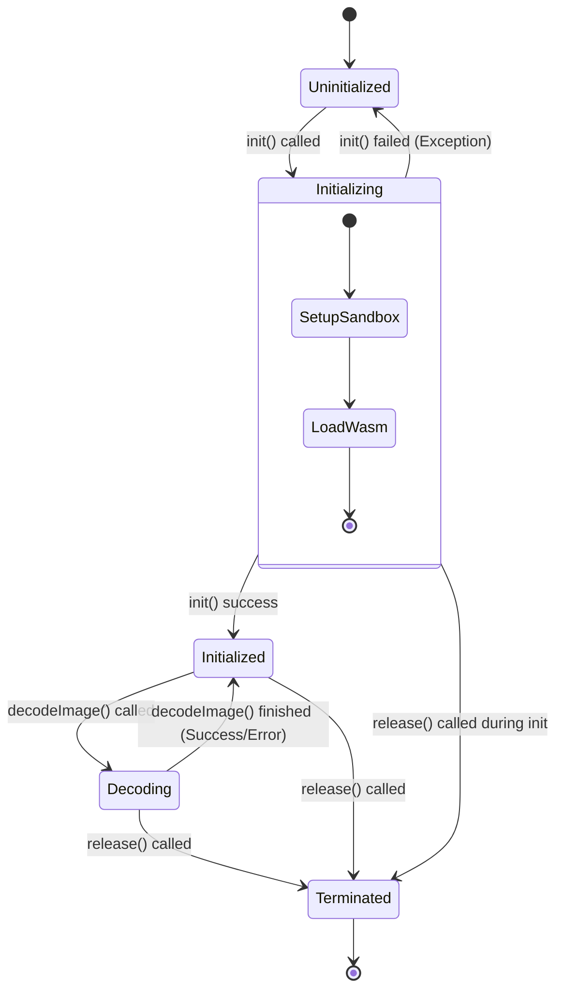

# Design

ライブラリのアーキテクチャは、大きく分けて以下の3つのレイヤーで構成されています。

## 1. android/lib (Kotlin/Android Layer)

Androidアプリから利用されるAPIを提供するレイヤーです。`Jp2kDecoder` クラスなどがこれに該当します。
Androidの `JavaScriptEngine` (Jetpack) を使用して、WASM化されたOpenJPEGを実行するためのサンドボックス環境を管理します。

### 受け持つ処理
*   **WASMのロードと初期化**: `openjpeg_core.wasm` をアセットから読み込み、`JavaScriptIsolate` 上でインスタンス化します。
*   **データの受け渡し**:
    *   入力: JPEG2000のバイト配列をHex文字列としてWASM側に渡します。
    *   出力: WASM側から返却されたJSON文字列（エラーコードまたはBMP画像のHex文字列）をパースします。
*   **画像変換**: 返却されたBMP形式のHex文字列をバイト配列に変換し、`BitmapFactory` を使用してAndroidの `Bitmap` オブジェクトを生成します。
    *   `ColorFormat` 指定 (RGB565 / ARGB8888) に応じて `BitmapFactory.Options` を設定し、適切なフォーマットで Bitmap を生成します。
*   **ライフサイクル管理**: `init()`, `release()` によるサンドボックスのリソース管理を行います。
*   **設定管理**: `Config` クラスを通じて、最大ヒープサイズや最大ピクセル数などのパラメータを管理・適用します。

### 入力値のチェック・バリデーション
*   **入力データ長**: 入力されたバイト配列の長さが `MIN_INPUT_SIZE` (12バイト) 未満でないかチェックします。
*   **初期化状態**: `init()` が呼ばれ、`jsIsolate` が有効であるかチェックします。

### State Machine (Jp2kDecoderAsync)

`Jp2kDecoderAsync` はスレッドセーフを保証するために内部状態 (`State`) を持ち、各メソッド呼び出し時に厳密な状態遷移チェックを行います。排他制御には `synchronized` ブロックを使用しています。

#### 状態定義
*   `Uninitialized`: 初期状態。`init()` の呼び出しのみ許可されます。
*   `Initializing`: 初期化処理中。バックグラウンドでのWASMロードやIsolate作成を行っています。
*   `Initialized`: 初期化完了。`decodeImage()` の呼び出しが可能な待機状態。
*   `Decoding`: デコード処理中。この状態のときに再度 `decodeImage()` が呼ばれるとエラーになります（並行実行の禁止）。
*   `Terminated`: 終了状態。`release()` が呼ばれた後の状態。これ以上の操作は受け付けません。

#### 状態遷移図

#### スレッドセーフ設計
*   **init()**: `Uninitialized` 状態でのみ開始可能。開始時に `Initializing` に遷移。完了時に `Initialized` に遷移。失敗時は `Uninitialized` に戻ります。
*   **decodeImage()**: `Initialized` 状態でのみ実行可能。実行開始時に `Decoding` に遷移し、完了時に `Initialized` に戻ります。これにより、デコード処理中の重複呼び出しを防止します。
*   **release()**: 任意の状態で呼び出し可能。呼び出されると即座に `Terminated` 状態に遷移し、以降の操作をブロックします。
    *   `Initializing` 中に `release()` が呼ばれた場合、バックグラウンド処理の要所で `Terminated` チェックが行われ、初期化処理が中断 (Cancellation) されます。
    *   `Decoding` 中に `release()` が呼ばれた場合、デコード処理完了後の状態復帰（`Initialized`への遷移）は行われません。

---

## 2. wrapper.c (C Wrapper for WASM)

OpenJPEGライブラリをWASMから扱いやすくするためのラッパーコードです。C言語で記述され、EmscriptenによってWASMにコンパイルされます。

### 受け持つ処理
*   **インターフェース公開**: JavaScriptから呼び出し可能な関数 `decodeToBmp` および `getLastError` をエクスポートします。
*   **フォーマット判定**: 入力データのシグネチャを確認し、JP2形式かJ2Kコードストリームかを判定します。
*   **BMP変換**: OpenJPEGによってデコードされた `opj_image_t` 構造体（各コンポーネントごとのデータ）を、指定された `color_format` に応じた BMPファイルフォーマットのバイト列に変換します。
    *   `ARGB8888`: 32bpp (BGRA) 標準BMP。
    *   `RGB565`: 16bpp (Bitfields) BMP。
*   **メモリ管理**: デコード結果のBMPデータを格納するバッファの確保(`malloc`)を行います（JavaScript側で `free` されることを期待します）。

### 入力値のチェック・バリデーション
*   **入力サイズ制限**: `max_heap_size` (Kotlin側から渡される設定値) と指定された `color_format` に基づき、最大入力データサイズを動的に計算します。
    *   `ARGB8888`: `max_heap_size / 4`
    *   `RGB565`: `max_heap_size / 2`
    *   これを超える場合は `ERR_INPUT_DATA_SIZE` を返します。
*   **ピクセル数制限**: デコード結果の総ピクセル数（幅×高さ）が `max_pixels` (Kotlin側から渡される設定値) を超える場合、`ERR_PIXEL_DATA_SIZE` を返し、処理を中断します。
*   **コンポーネント数**: 画像が少なくとも3つのコンポーネント（RGB）を持っているか確認します。不足している場合はエラーとします。

---

## 3. OpenJPEG (Native Library)

JPEG 2000規格 (ISO/IEC 15444-1) に準拠したデコード処理を行うコアライブラリです。

### 受け持つ処理
*   **コードストリーム解析**: JPEG 2000のパケット、タイル、プレシンクトなどの構造を解析します。
*   **エントロピーデコード**: 圧縮データを解凍します。
*   **逆ウェーブレット変換**: 周波数領域のデータを空間領域（ピクセルデータ）に変換します。
*   **色空間変換**: 必要に応じて色空間の変換処理を行います。

### 入力値のチェック・バリデーション
*   **規格準拠チェック**: 入力データがJPEG 2000の規格に準拠しているか、破損していないかを内部的に検証します。不整合がある場合、デコード処理関数 (`opj_decode` 等) が失敗を返します。
