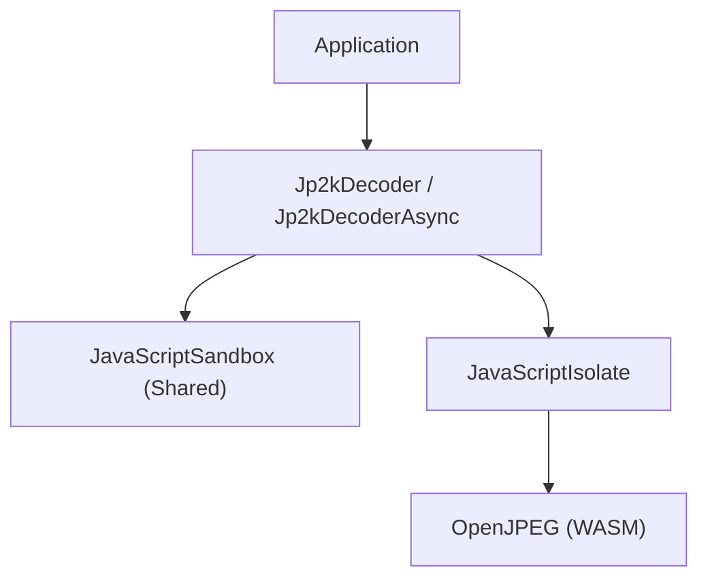
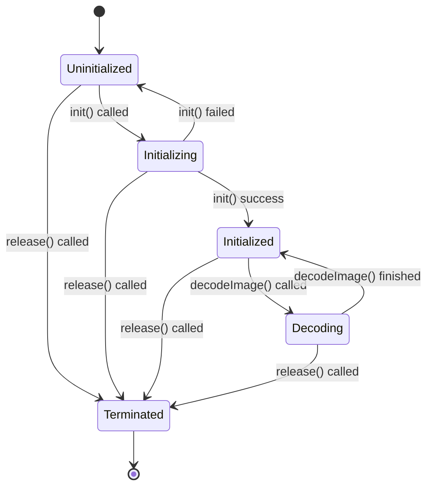

# Design Document

## Architecture

This project enables JPEG2000 image decoding on Android by running OpenJPEG compiled to WebAssembly (WASM) within the Android Jetpack JavaScript Engine.

### Structure

*   **Jp2kDecoder**: A Coroutine-native implementation for decoding. Recommended for Kotlin projects.
*   **Jp2kDecoderAsync**: A Callback-based implementation for decoding. Recommended for Java projects or if explicit Executor management is needed.
*   **JavaScriptSandbox**: A shared component provided by the Android system/library. It is managed as a Singleton to avoid connection overhead.
*   **JavaScriptIsolate**: An isolated execution environment created per Decoder instance.

### State Management

Both `Jp2kDecoder` and `Jp2kDecoderAsync` share the same State definition (`dev.keiji.jp2k.State`).

*   **Uninitialized**: Initial state.
*   **Initializing**: `init()` is in progress.
*   **Initialized**: Ready to decode.
*   **Decoding**: `decodeImage()` is in progress.
*   **Terminated**: `release()` has been called.

#### State Transitions

### Jp2kDecoder (Coroutines)

*   **init(context)**: Suspending function. Initializes the isolate. Safe to call concurrently (serialized via Mutex).
*   **decodeImage(bytes)**: Suspending function. Decodes the image on `Dispatchers.Default`.
*   **release()**: Closes the isolate immediately.

### Jp2kDecoderAsync (Callbacks)

*   **init(context, callback)**: Runs on background executor.
*   **decodeImage(bytes, callback)**: Runs on background executor. Queues requests if multiple are called, but generally intended for serial use.
*   **release()**: Closes the isolate and shuts down the executor.

## Data Transfer

Data is transferred between Kotlin and WASM via Hex strings (currently) to ensure compatibility and simplicity with the JS Engine constraints.

1.  Kotlin: `ByteArray` -> Hex String
2.  JS Bridge: Hex String -> `Uint8Array`
3.  WASM: `malloc` -> `Uint8Array` copy
4.  WASM: Decode -> BMP Buffer
5.  JS Bridge: BMP Buffer -> Hex String
6.  Kotlin: Hex String -> `ByteArray` -> `BitmapFactory.decodeByteArray`
