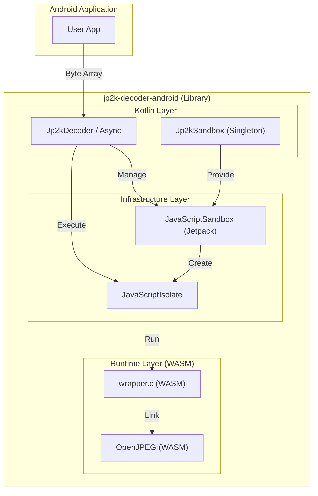
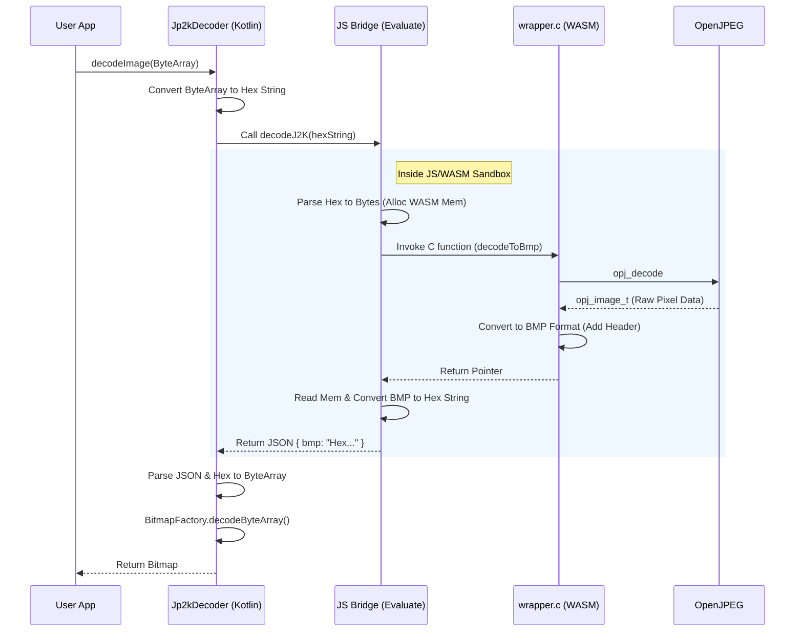
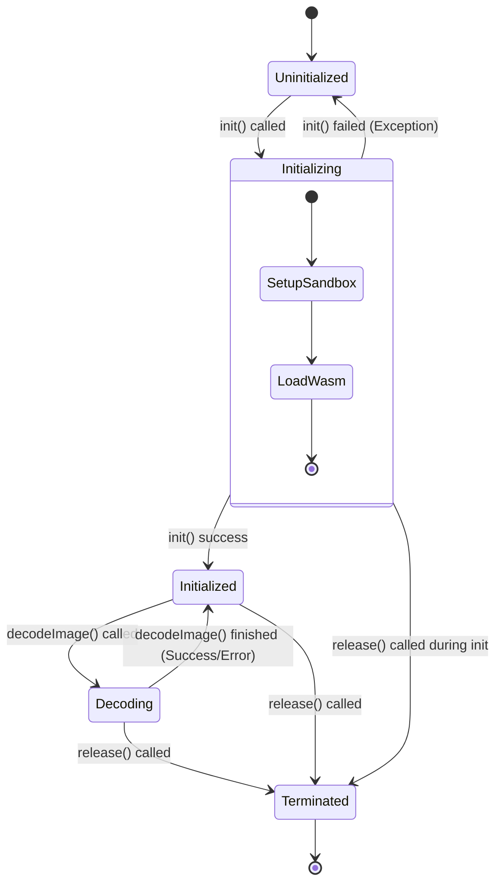

# Design

ライブラリのアーキテクチャ概要と、構成する各コンポーネントについて説明します。

## Architecture Overview

本ライブラリは、AndroidのJetpack JavaScriptEngineを利用して、WASM (WebAssembly) にコンパイルされたOpenJPEGライブラリをサンドボックス環境で実行します。これにより、ネイティブコードの実行に伴うセキュリティリスクを隔離し、安全にJPEG2000画像のデコードを行います。

## Data Flow (Decoding)

画像デコード時のデータフローは以下の通りです。

---

## 1. android/lib (Kotlin/Android Layer)

Androidアプリから利用されるAPIを提供するレイヤーです。`Jp2kDecoder` (Coroutine対応) および `Jp2kDecoderAsync` (Callback対応) がこれに該当します。

### コンポーネント構成
*   **Jp2kDecoder / Jp2kDecoderAsync**: ユーザー向けAPI。デコード要求を受け付け、バックグラウンドスレッドで処理を行います。
*   **Jp2kSandbox**: シングルトンオブジェクトとして `JavaScriptSandbox` の接続を管理します。アプリ全体で1つの接続を再利用することで、オーバーヘッドとリソース消費を最小限に抑えます。

### 受け持つ処理
*   **WASMのロードと初期化**: `openjpeg_core.wasm` をアセットから読み込み、`Jp2kSandbox` から取得したサンドボックス上の `JavaScriptIsolate` でインスタンス化します。
*   **データの受け渡し (Hex Encoding)**:
    *   WASM環境とのデータ授受には、バイナリデータをHex文字列（16進数文字列）にエンコードして渡す方式を採用しています。これは、JavaScriptEngineの制約や、Base64処理のオーバーヘッド回避などを考慮した実装詳細です。
*   **画像変換**: 返却されたBMP形式のHex文字列をバイト配列に変換し、`BitmapFactory` を使用してAndroidの `Bitmap` オブジェクトを生成します。
    *   `ColorFormat` 指定 (RGB565 / ARGB8888) に応じて `BitmapFactory.Options` を設定し、適切なフォーマットで Bitmap を生成します。
*   **ライフサイクル管理**: `init()`, `release()` による `JavaScriptIsolate` のリソース管理を行います。`release()` 実行時には Isolate をクローズし、処理を強制終了します。
*   **設定管理**: `Config` クラスを通じて、最大ヒープサイズや最大ピクセル数などのパラメータを管理・適用します。

### State Machine (Jp2kDecoderAsync)

`Jp2kDecoderAsync` はスレッドセーフを保証するために内部状態 (`State`) を持ち、各メソッド呼び出し時に厳密な状態遷移チェックを行います。排他制御には `synchronized` ブロックを使用しています。

#### 状態定義
*   `Uninitialized`: 初期状態。`init()` の呼び出しのみ許可されます。
*   `Initializing`: 初期化処理中。バックグラウンドでのWASMロードやIsolate作成を行っています。
*   `Initialized`: 初期化完了。`decodeImage()` の呼び出しが可能な待機状態。
*   `Decoding`: デコード処理中。この状態のときに再度 `decodeImage()` が呼ばれるとキューイングまたはエラーになります（並行実行の制御）。
*   `Terminated`: 終了状態。`release()` が呼ばれた後の状態。これ以上の操作は受け付けません。

#### 状態遷移図

#### メソッドごとの挙動

各状態におけるメソッド呼び出し時の挙動は以下の通りです。

| State \ Method | init() | decodeImage() | getMemoryUsage() | release() |
| :--- | :--- | :--- | :--- | :--- |
| **Uninitialized** | **初期化開始** | Error | Error | 終了処理 (State=Terminated) |
| **Initializing** | Error | Error | Error | 終了処理 (State=Terminated) |
| **Initialized** | **成功 (何もしない)** | **デコード開始** | **取得開始** | 終了処理 (State=Terminated) |
| **Decoding** | Error | **デコード開始 (キューイング)** | **取得開始 (キューイング)** | 終了処理 (State=Terminated) |
| **Terminated** | Error | Error | Error | **成功 (何もしない)** |

* **Error**: `IllegalStateException` (またはそれに準ずるエラー) をコールバックに返却します。
* **初期化開始**: バックグラウンドで初期化処理を開始します。
* **デコード開始**: バックグラウンドでデコード処理を開始します。
* **取得開始**: バックグラウンドでメモリ使用量の取得を開始します。
* **キューイング**: 実行中の処理が完了した後、順次実行されます。

---

## 2. wrapper.c (C Wrapper for WASM)

OpenJPEGライブラリをWASMから扱いやすくするためのラッパーコードです。C言語で記述され、EmscriptenによってWASMにコンパイルされます。

### 受け持つ処理
*   **インターフェース公開**: JavaScriptから呼び出し可能な関数 `decodeToBmp` などをエクスポートします。
*   **フォーマット判定**: 入力データのシグネチャを確認し、JP2形式かJ2Kコードストリームかを内部で自動判定します（OpenJPEG API利用）。
*   **BMP変換**: OpenJPEGによってデコードされた `opj_image_t` 構造体（各コンポーネントごとのデータ）を、指定された `color_format` に応じた BMPファイルフォーマットのバイト列に変換します。
    *   `ARGB8888`: 32bpp (BGRA) 標準BMP。
    *   `RGB565`: 16bpp (Bitfields) BMP。
*   **メモリ管理**: デコード結果のBMPデータを格納するバッファの確保(`malloc`)を行います（JavaScript側で `free` されることを期待します）。

### 入力値のチェック・バリデーション
*   **入力サイズ制限**: `max_heap_size` (Kotlin側から渡される設定値) と指定された `color_format` に基づき、最大入力データサイズを動的に計算します。
    *   `ARGB8888`: `max_heap_size / 4`
    *   `RGB565`: `max_heap_size / 2`
    *   これを超える場合は `ERR_INPUT_DATA_SIZE` を返します。
*   **ピクセル数制限**: デコード結果の総ピクセル数（幅×高さ）が `max_pixels` (Kotlin側から渡される設定値) を超える場合、`ERR_PIXEL_DATA_SIZE` を返し、処理を中断します。
*   **コンポーネント数**: 画像が少なくとも3つのコンポーネント（RGB）を持っているか確認します。不足している場合はエラーとします。

---

## 3. OpenJPEG (Native Library)

JPEG 2000規格 (ISO/IEC 15444-1) に準拠したデコード処理を行うコアライブラリです。

### 受け持つ処理
*   **コードストリーム解析**: JPEG 2000のパケット、タイル、プレシンクトなどの構造を解析します。
*   **エントロピーデコード**: 圧縮データを解凍します。
*   **逆ウェーブレット変換**: 周波数領域のデータを空間領域（ピクセルデータ）に変換します。
*   **色空間変換**: 必要に応じて色空間の変換処理を行います。

### 入力値のチェック・バリデーション
*   **規格準拠チェック**: 入力データがJPEG 2000の規格に準拠しているか、破損していないかを内部的に検証します。不整合がある場合、デコード処理関数 (`opj_decode` 等) が失敗を返します。
